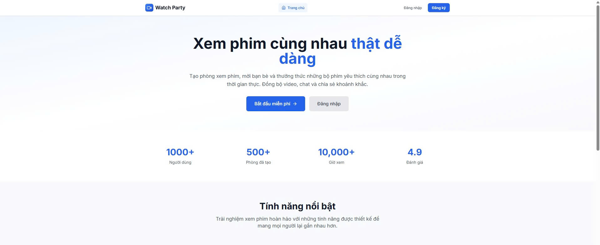
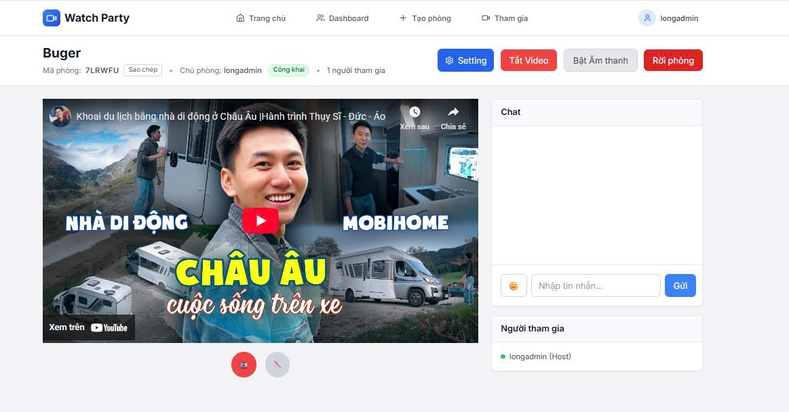
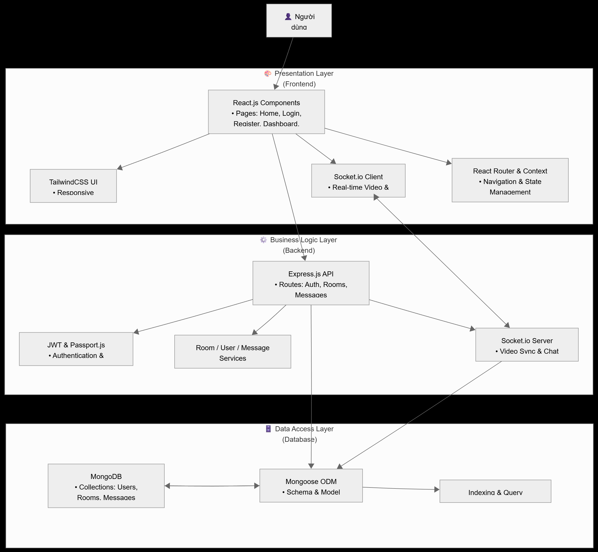

# Watch Party

Nền tảng xem video đồng bộ theo thời gian thực với chat, điều khiển video tập trung và quản lý phòng.

---

## 1) Mô tả ngắn, tính năng chính, ảnh chụp màn hình

- **Mô tả**: Ứng dụng cho phép nhiều người dùng cùng xem một video đồng bộ, trò chuyện realtime, quản lý thành viên và quyền điều khiển.
- **Tính năng chính**:
  - Đăng ký/Đăng nhập (username/email + password), Google OAuth (Passport)
  - Tạo/Tham gia phòng bằng mã hoặc mật khẩu, giới hạn số thành viên
  - Đồng bộ video (play/pause/seek), yêu cầu đồng bộ trạng thái
  - Chat realtime, reaction, trả lời tin nhắn, đánh dấu đã xem
  - Phân quyền host/moderator cơ bản; cập nhật cài đặt phòng
  - Bảo mật: JWT, Helmet, CORS, Rate limiting, validate input

Ảnh chụp màn hình:

- Trang tổng quan/luồng hệ thống:

  

  
- Luồng chức năng:

  

---

## 2) Kiến trúc

- **Sơ đồ tổng thể**: Frontend (React) giao tiếp Backend (Node/Express) qua HTTP và Socket.io; lưu trữ tại MongoDB. Xem tài liệu chi tiết trong `Doc/System_Architecture_Analysis.md`.
- **Tech stack**:
  - Frontend: React 18, React Router, TailwindCSS, Socket.io Client, React Hook Form, React Hot Toast, React Player
  - Backend: Node.js, Express, Socket.io, Mongoose, JWT, Passport (Google OAuth), express-validator, Helmet, CORS, express-rate-limit
  - Database: MongoDB (Mongoose ODM)
- **Lý do chọn**:
  - Socket.io cho realtime ổn định, API đơn giản; phù hợp mô hình room/event
  - MongoDB linh hoạt cho dữ liệu phòng/tin nhắn theo luồng thời gian
  - React + Context cho state chia sẻ (AuthContext, SocketContext), DX tốt
  - Express nhỏ gọn, hệ sinh thái middleware phong phú (auth, validate, security)

Tham khảo thêm trong `Doc/System_Architecture_Analysis.md` (có use cases, flows, endpoints, và sơ đồ).

---

## 3) Hướng dẫn chạy nhanh

### 3.1 Chạy Local

Yêu cầu: Node.js LTS, MongoDB đang chạy (mặc định `mongodb://localhost:27017/watch-party`).

- Tạo file `.env` trong `backend/` dựa trên `backend/env.example`:

  Các biến cần có tối thiểu:

  - `MONGODB_URI=mongodb://localhost:27017/watch-party`
  - `JWT_SECRET=<chuoi_bi_mat>`
  - `PORT=5000`
  - `FRONTEND_URL=http://localhost:3000`
  - (Nếu dùng Google OAuth): `GOOGLE_CLIENT_ID`, `GOOGLE_CLIENT_SECRET`
- Cài đặt và chạy Backend:

  ```bash
  cd backend
  npm install
  npm run dev
  # hoặc: npm start
  ```
- Cài đặt và chạy Frontend:

  ```bash
  cd frontend
  npm install
  npm start
  # app chạy tại http://localhost:3000 (proxy tới backend:5000)
  ```

Windows có sẵn script PowerShell/BAT để khởi động nhanh:

- `start-watchparty.ps1` hoặc `thuc_thi/start-watchparty.bat`
- Script hỗ trợ khởi động từng phần trong thư mục `thuc_thi/` và `scripts/`

### 3.2 Chạy bằng Docker (tham khảo)

Hiện repo chưa kèm sẵn `Dockerfile`/`docker-compose.yml`. Bạn có thể tham khảo cấu hình tối thiểu dưới đây và tự thêm file:

- `docker-compose.yml` gợi ý:

  ```yaml
  version: '3.9'
  services:
    mongo:
      image: mongo:6
      ports:
        - "27017:27017"
      volumes:
        - mongo_data:/data/db

    backend:
      build: ./backend
      environment:
        MONGODB_URI: mongodb://mongo:27017/watch-party
        JWT_SECRET: change-me
        PORT: 5000
        FRONTEND_URL: http://localhost:3000
      depends_on:
        - mongo
      ports:
        - "5000:5000"

    frontend:
      build: ./frontend
      environment:
        REACT_APP_API_BASE: http://localhost:5000
      depends_on:
        - backend
      ports:
        - "3000:3000"

  volumes:
    mongo_data:
  ```
- Thêm `Dockerfile` tối thiểu ở `backend/` và `frontend/` theo chuẩn Node (cài deps, expose port, start).

### 3.3 Seeding dữ liệu

Có 2 cách:

- Seeding tổng hợp (users/rooms/messages):

  ```bash
  cd Database
  node init-database.js
  ```

  Tài khoản mẫu: `admin/password`, `user1/password`, `user2/password`.
- Tạo nhiều user mẫu nhanh:

  ```bash
  cd backend
  node create-sample-users.js
  ```

  Users mẫu (ví dụ) sẽ được in ra console: `alice_watch`, `bob_stream`, `charlie_view`, `diana_party`, `eric_sync` (mật khẩu theo script).

---

## 4) Tài khoản demo, Swagger, link deploy

- **User demo**:
  - Từ `Database/init-database.js`: `admin/password`, `user1/password`, `user2/password`
  - Từ `backend/create-sample-users.js`: nhiều tài khoản mẫu như `alice_watch` (mật khẩu hiển thị khi chạy script)
- **Admin**: `admin/password` (role `admin` trong seeding tổng hợp)
- **Swagger/OpenAPI**: Chưa tích hợp sẵn trong repo. Có thể thêm nhanh `swagger-ui-express` và YAML/JSON sau.

---

## 5) Cấu trúc thư mục và Conventions

- Cấu trúc chính:

  ```
  backend/
    config/passport.js
    middleware/auth.js
    models/{User,Room,Message}.js
    routes/{auth,rooms,messages,admin}.js
    server.js
    env.example
  frontend/
    src/
      pages/{Home,Login,Register,Dashboard,Room}.js
      components/{Navbar,Footer}.js
      contexts/{AuthContext,SocketContext}.js
      App.js, index.js, index.css
    public/index.html
  Database/
    {init-database,backup-database,restore-database}.js
  Doc/
    System_Architecture_Analysis.md
  scripts/, thuc_thi/, *.ps1, *.bat
  ```
- Coding style (đề xuất áp dụng nhất quán):

  - JavaScript/Node: ES2019+, async/await, early-return, validate bằng `express-validator`
  - Frontend: React hooks, Context cho Auth/Socket, tách nhỏ component, đặt tên rõ nghĩa
  - Bảo mật: không log secrets; dùng `helmet`, `rate-limit`, CORS allowlist (`FRONTEND_URL`)
- Commit convention (đề xuất Conventional Commits):

  - `feat:`, `fix:`, `chore:`, `docs:`, `refactor:`, `perf:`, `test:`
- Branching (đề xuất):

  - `main` (ổn định), `dev` (tổng hợp), tính năng theo dạng `feat/<ten-tinh-nang>`

---

## 6) Kịch bản demo (use cases chính, đường dẫn UI & API)

- Use cases chính (tham khảo chi tiết trong `Doc/System_Architecture_Analysis.md`):

  - UC001-005: Đăng ký/Đăng nhập/Google OAuth/Profile/Đăng xuất
  - UC006-014: Tạo/Tham gia/Xóa/Cập nhật phòng, tìm kiếm, lọc
  - UC015-019: Đồng bộ video (play/pause/seek, request-sync, sync-state)
  - UC020-025: Chat realtime, typing, reactions, reply, seen
- Đường dẫn UI (mặc định):

  - `/` Trang chủ
  - `/login`, `/register`
  - `/dashboard`
  - `/room/:id` (phòng)
- Đường dẫn API chính:

  - Auth: `POST /api/auth/register`, `POST /api/auth/login`, `GET /api/auth/me`, `POST /api/auth/logout`, `GET /api/auth/google`, `GET /api/auth/google/callback`
  - Rooms: `POST /api/rooms`, `GET /api/rooms`, `GET /api/rooms/:id`, `POST /api/rooms/:id/join`, `POST /api/rooms/:id/leave`, `PUT /api/rooms/:id`, `DELETE /api/rooms/:id`, `GET /api/rooms/code/:roomCode`, `PUT /api/rooms/:roomId/video-url`
  - Messages: `POST /api/messages/:roomId`, `GET /api/messages/:roomId`, `PUT /api/messages/:roomId/:messageId`, `DELETE /api/messages/:roomId/:messageId`, `POST /api/messages/:roomId/:messageId/reaction`, `GET /api/messages/:roomId/:messageId`, `GET /api/messages/:roomId/search?q=...`
  - Admin (yêu cầu token + role): `GET /api/admin/users`, `GET /api/admin/rooms`, `PATCH /api/admin/rooms/:id/moderators`
- Socket events tiêu biểu:

  - Room: `join-room`, `leave-room`, `user-joined`, `user-left`, `room-users`
  - Video: `video-control`, `request-sync`, `sync-state`, `video-url-changed`
  - Chat: `chat-message`, `user-typing`, `message-seen`
- Postman/Manual test: có các script mẫu trong `backend/{simple-api-test.js, test-api.js, manual-api-test.js, quick-test.js}`.

---

## API Docs & DB Schema

- **API docs (OpenAPI/Swagger)**: Chưa kèm sẵn file JSON/YAML. Gợi ý nhanh để bổ sung:

  - Cài đặt: `npm i swagger-ui-express swagger-jsdoc`
  - Khởi tạo swagger ở `backend/server.js`, mount tại `/api/docs`
- **DB schema (ERD)**:

  - Mô tả schema và quan hệ đã được tóm lược trong `Doc/System_Architecture_Analysis.md` (mục "Sơ đồ Database Schema").
  - Có thể dùng công cụ như `mongodump` + draw.io/DBML để xuất ERD và lưu ảnh vào `Doc/` hoặc `image/`.

---

## Môi trường & Cấu hình

- File mẫu: `backend/env.example`
- Biến quan trọng:
  - `MONGODB_URI` – kết nối MongoDB
  - `JWT_SECRET` – ký JWT
  - `PORT` – cổng backend (mặc định 5000)
  - `FRONTEND_URL` – nguồn CORS và redirect OAuth
  - `GOOGLE_CLIENT_ID`, `GOOGLE_CLIENT_SECRET` – bật Google OAuth (nếu dùng)
